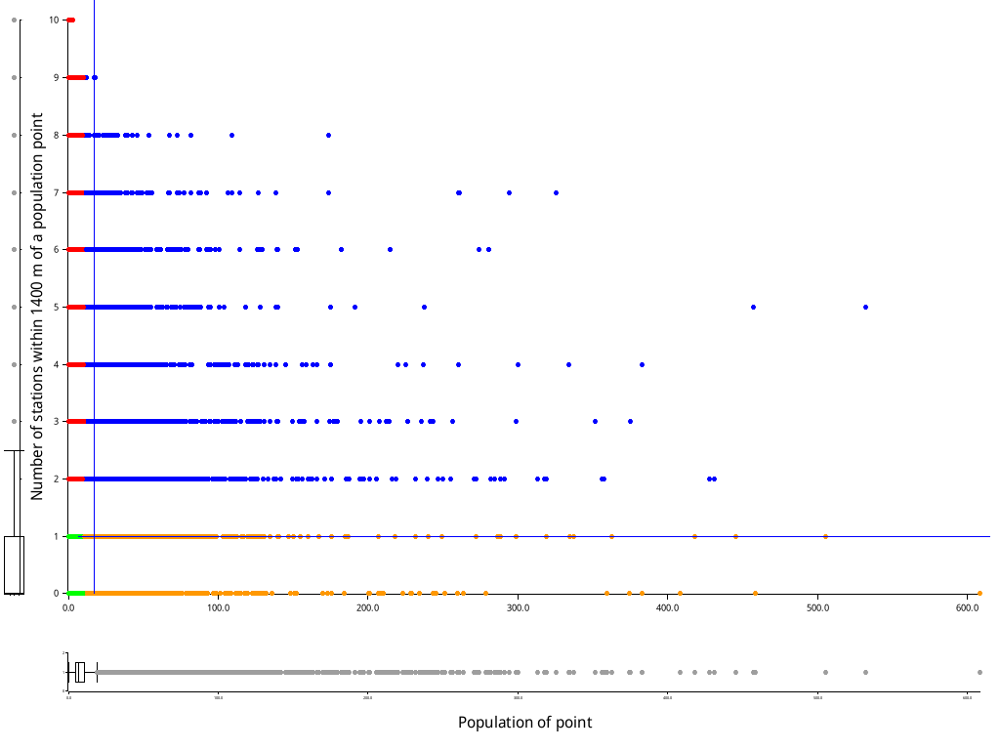
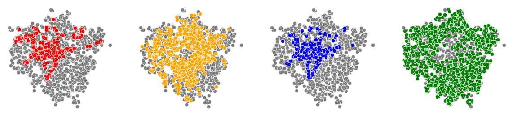
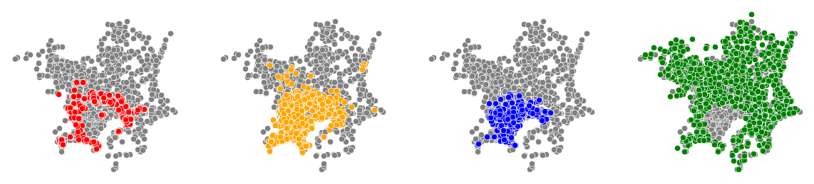

# atupp - Analysing transportation using population points

Based on [my paper here](https://github.com/akazukin5151/papers/blob/main/6SSG3077_CW2_1931393.pdf)

At that time I wasn't able to deal with datasets that are too large, so I resorted to randomly sampling population points for analysis. It was a failure that constantly nagged me, so I decided to tackle it again.

Python couldn't handle it so I used Rust. But I again reached a point where using a naive algorithm is too slow because of asymptotic complexity. The most significant change was to use a proper spatial data structure, the R\* tree, to efficiently search for points. Python still couldn't handle plotting large amounts of data, so I used [plotters](https://docs.rs/plotters/latest/plotters/) instead.

## Gallery


Proportion of city population that is within a certain distance from at least one train station. Read: around 30% of London's population is within 1100 meters of a station, compared to around 43% for Tokyo.


London: Box plot of number of stations that are within a certain distance from a population point.


Tokyo: Box plot of number of stations that are within a certain distance from a population point.

For both cities, most population points have zero stations near it. The minority that do, mostly has two stations near it. There is a very small number of points that has a lot of stations near it.



London: Scatterplot of the number of stations that are within 1400m of a population point, and its population.

There are two lines dividing the plot. The vertical line represents the 3rd quartile of the population of the points. The horizontal line represents the 3rd quartile of the number of stations, which is 1 station at 1400 meters. The points are coloured based on their quadrant. Red points are those with a "normal" population but high number of stations near it. Orange points are those with high population but low number of stations near it. Blue points are those with both high population and high number of stations near it. Green points are those with both low population and low number of stations near it.


Tokyo: Scatterplot of the number of stations that are within 1400m of a population point, and its population



London: map of the population points coloured by its quadrants in the scatterplot above. The red points closely follow the tube stations. There is not a lot of people that live 1400m within a station, so it is low population but "high" number of stations near it. The blue points also follow tube stations but closer to the city center, which makes sense as the population are higher nearer the center. Most of London is yellow or green - that is, with few stations close by, regardless of population. Yellow is for high population and green is for low population, which is why yellow points are tend to be more central than green, which is properly "rural".



Tokyo: map of the population points coloured by its quadrants in the scatterplot above. The red points also closely matches the train stations, except for central Tokyo. The red quadrant indicates points with normal population, which excludes the high population points in the urban center. The other differentiator is "high" number of stations near it, so it obviously will coalesce around train stations. Green points are also normal population but without stations nearby, which is everywhere else except for the urban center. There is one exemption for the red points - the imperial residence in the center of the city. Both yellow and blue points indicate high population. The blue points are more concentrated in the urban center, which has higher population, and is roughly Tokyo Prefecture, Kanagawa Prefecture, and some cities in Chiba and Saitama Prefectures. The yellow points are the "suburban" places, including more of Saitama and the northern portion of the Kanto Plain.

# Data sources

## data/pp/jpn_population_2020.csv
https://data.humdata.org/dataset/japan-high-resolution-population-density-maps-demographic-estimates

CRS: WGS84, EPSG:4326

## data/pp/population_gbr_2019-07-01.csv
https://data.humdata.org/dataset/united-kingdom-high-resolution-population-density-maps-demographic-estimates

CRS: WGS84, EPSG:4326

## data/tokyo boundaries/gadm
https://gadm.org/download_country_v3.html

CRS: WGS84, EPSG:4326

## data/london boundaries/statistical-gis-boundaries-london
https://data.london.gov.uk/dataset/statistical-gis-boundary-files-london

**CRS: British National Grid, EPSG:27700**

## London station coordinates

[TfL public API](https://api.tfl.gov.uk)

## Tokyo station coordinates

[https://www.odpt.org/](https://www.odpt.org/)

Note: it's better to use OpenStreetMap data, because they are complete. This API has a lot of missing coordinates, but I used this because at that time I was exploring the uses of the API.

# Download the data

## London station data

### Fetch London lines data

```sh
cd data/london_trains/lines/
curl "https://api.tfl.gov.uk/Line/Mode/tube/Route" > tube_lines.json
```

### Get London stations

```sh
cd data/london_trains/lines/
jq '.[].id' tube_lines.json > line_ids.txt
```

This command selects all `id` values in every train line. The output is every train line separated by newline. You can avoid installing `jq` by writing a python script or similar. 

### Fetch London station coordinates

```sh
python python/london stations/get_stations.py
```

This command queries the TfL API. For every train line found in the above step, it queries every station on that line.

### Combine London station coordinates

```sh
python python/london stations/station_coords.py
```

## Tokyo station data

Note: it's better to use OpenStreetMap data, because they are complete. This API has a lot of missing coordinate

### Fetch Tokyo Lines data

The Tokyo data is from [https://www.odpt.org/](https://www.odpt.org/). Go to [https://developer-dc.odpt.org/en/info](https://developer-dc.odpt.org/en/info) and create an account. Get your consumer key and export it as an environment variable, then make a query for stations.

```sh
export CONSUMERKEY="your consumer key"
curl -X GET https://api.odpt.org/api/v4/odpt:Station?acl:consumerKey=$CONSUMERKEY
```

### Fix the data

TODO

# Data preprocessing

## Convert London boundaries to WGS84, EPSG:4326

Use QGIS, export it as GeoJSON

## Extract Tokyo boundaries from the Japan boundaries

In QGIS, select the prefectures Tokyo, Saitama, Chiba, Kanagawa, Tochigi, Ibaraki, Gunma. Export it as GeoJSON

This is a pretty wide definition of "Greater Tokyo", but the Japanese government uses "Capital ring" (首都圏), which includes even Yamanashi.

## Clip the national population points to its cities

```sh
cd rust
cargo b --release --bin clip_pp
# Usage: target/release/clip_pp [city]
target/release/clip_pp london > ../data/london_pp.csv
target/release/clip_pp tokyo > ../data/tokyo_pp.csv
```

It reads the entire population point file into memory, then splits up the file to process the chunks in parallel across multiple CPUs. To avoid accumulating a potentially huge result, it writes the results immediately after calculating it. To simplify things, writing is done by printing to stdout instead of writing to a file. Use a UNIX pipe to divert stdout to a file. Rust already uses a mutex when writing to stdout, so there are no race conditions.

This is the first step that takes significant time (10 minutes for London, 28 minutes for Tokyo). Technically the city boundaries are multi-polygons so every polygon is compared, but in practice the number of population points dominates and it is always possible to dissolve the multi-polygons into one.

## Reproject stations and population points into WGS84, Pseudo-Mercator, EPSG:3857

```sh
python python/reproj_to_meters.py london_trains
python python/reproj_to_meters.py tokyo_trains
python python/reproj_to_meters.py london_pp
python python/reproj_to_meters.py tokyo_pp
```

Calculating distances requires the coordinates to be in meters rather than lat/long.

# Analysis

## Barplot: cumulative population within a certain distance of a train station

```sh
cd rust
cargo b --release --bin cumulative_props
# Usage: target/release/cumulative_props [city]
target/release/cumulative_props london > ../data/london_props.csv
target/release/cumulative_props tokyo > ../data/tokyo_props.csv
cd ..
python python/plot_props.py
```

## Boxplot: stations within population points

```sh
cd rust
cargo b --release --bin stations_within_pp
# Usage: target/release/stations_within_pp [city]
target/release/stations_within_pp london
target/release/stations_within_pp tokyo
```

A brute force search has time complexity O(n\*m), where n is the number of stations and m is the number of population points. There are millions to billions of population points so asymptotic growth is really important here.

This program uses a R\* tree, which is O(log(n)) for searching, and O(n\*log(n)) for insertion. If we only insert the stations (Tokyo has only ~1000), then insertion time is negligible. Bulk loading the stations will also reduce tree building time.

There are m population points, so searching for the nearest station for every population point is O(m\*log(n)). The number of population points m >>> number of stations n, m >>> log(n), so it's basically O(m). This is significantly faster than O(n\*m).

## Scatterplot with quadrants: Population points and number of stations within X meters of the points

We choose 1400 meters here because this is the closest distance where the Q3 of number of stations within 1400 meters is higher than 1, for both cities

```sh
cd rust
cargo b --release --bin quadrants
# Usage: target/release/quadrant [X meters]
target/release/quadrants 1400
```

## Map of all population points, colored by their quadrant

```sh
cd rust
target/release/quadrant_coords london 1400 red > ../data/london_reds.csv
target/release/quadrant_coords london 1400 orange > ../data/london_oranges.csv
target/release/quadrant_coords london 1400 blue > ../data/london_blues.csv
target/release/quadrant_coords london 1400 green > ../data/london_greens.csv

target/release/quadrant_coords tokyo 1400 red > ../data/tokyo_reds.csv
target/release/quadrant_coords tokyo 1400 orange > ../data/tokyo_oranges.csv
target/release/quadrant_coords tokyo 1400 blue > ../data/tokyo_blues.csv
target/release/quadrant_coords tokyo 1400 green > ../data/tokyo_greens.csv

cd ..
python python/plot_quadrants_map.py london
python python/plot_quadrants_map.py tokyo
```

The individual quadrants can be mapped alone as well:

```sh
cargo b --release --bin quadrant_coords
# Usage: target/release/quadrant_coords [city] [X meters] [point_type]
target/release/quadrant_coords london 1400 red > ../data/london_reds.csv
target/release/quadrant_coords tokyo 1400 red > ../data/tokyo_reds.csv

cd ..
python python/plot_significant_quadrants_map.py london reds
python python/plot_significant_quadrants_map.py tokyo reds
```

Replace `reds` with `oranges`/`blues`/`greens`
